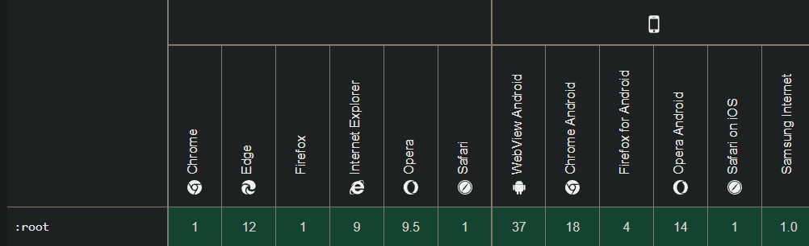

# TIC-TAC-TOE

## User stories
- [x] As a player, I want to be able to play hot-seat tic-tac-toes.
- [x] As a player, I want the game to be classic 3x3 board.
- [x] As the first player, I want to play as X.
- [x] As the second player, I want to play as O.
- [x] As a player, I want to be able to win the game by placing 3 Xs or Os in a row.
- [x] As a player I want to be able to draw the game, if nor I nor the enemy place 3 symbols in a row.
- [x] As a player, I want to be able to see the history of all played games.
- [x] As a player, I want to be able to see the history of locally played games.
- [x] As a player, I want to be able to see theoretical winning rates.
- [x] As a player, I want to be able to see the winning rates of all played games.
- [x] As a player, I want to be able to see the winning rates of locally played games.
- [ ] As a player, I want to be able to clear local history.
- [ ] As a player, I want to be able to restart the game without reloading the whole page.
- [ ] As a player, I want to be able to go back to the game page without using the browser's 'go back' button.

## Requirements
- Server
  - Jetty Server
  - Maven
  - Java 16 or higher
  

- Browser
  - resolution at least:
    - Width: 520px
    - Height: 770px
  - :root compatible
     
     Image source: [MDN](https://developer.mozilla.org/en-US/docs/Web/CSS/:root#browser_compatibility)

## Tested in browsers:
- Desktop
  - Microsoft Edge (version 95.0.1020.44) 64-bit
  
  - FIXME:
    - None

- Mobile
  - Microsoft Edge (version 95.0.1020.48)
  - Google Chrome (version 95.0.4638.74)
  
  - FIXME:
    - History layout overlap
    - Works only in portrait mode

## How to run
### IntelliJ Idea

- Click on 'Add configuration...'
- Click on '+'
- Select 'Jetty Server' -> 'Local'
- Insert into 'VM Options':
  > --add-opens java.base/java.lang=ALL-UNNAMED
- Select 'Deployment' tab
- Click on '+'
- Select 'Artifact'
- Select 'seminarka:war exploded'
- OK
- OK
- Optional:
  - Change database properties in [`src/main/resources/META-INF/persistence.xml`](src/main/resources/META-INF/persistence.xml) (marked by `<!-- change me -->`)
- Run 